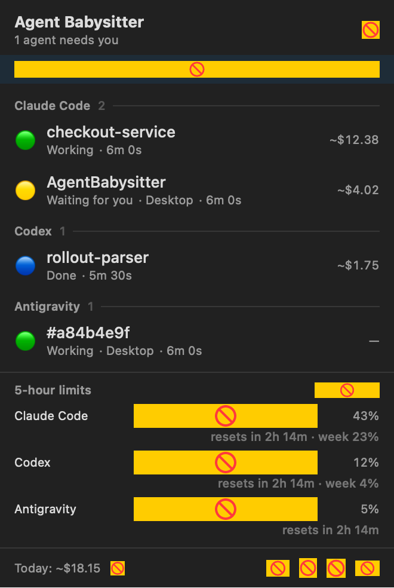
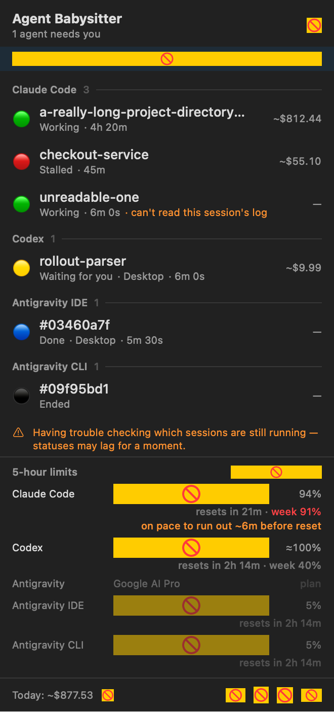
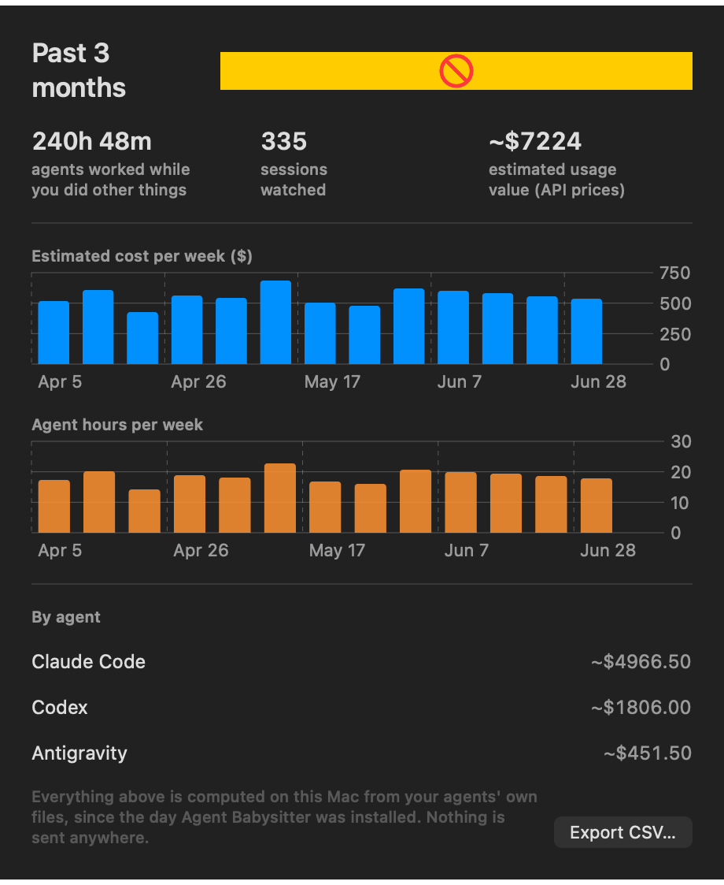
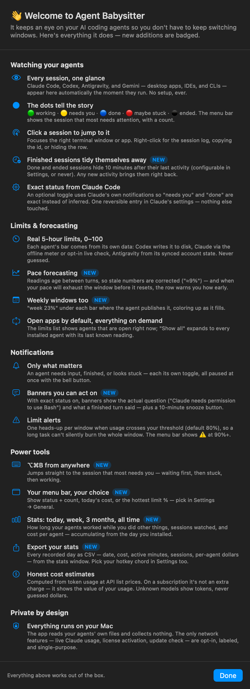

# Agent Babysitter

macOS menu bar app that monitors running coding-agent sessions (Claude Code, Codex, Antigravity, Gemini, Cursor, and Manus): working /
waiting for you / done / stalled / ended — with native notifications and, where
the agent exposes token counts, live per-session cost.

**Your transcripts and prompts never leave your Mac.** All session parsing,
state, and cost run locally against files already on disk, and the app sends no
analytics or telemetry about you to anyone. A few clearly labeled features do
reach the network — the daily update check, exchange rates when you pick a
non-USD currency, opt-in Live usage, and license activation — each named in the
[Network](#network) table below.

## What it looks like

| The menu | Limits & forecasting |
|---|---|
|  |  |

| Your stats | The feature tour |
|---|---|
|  |  |

*(Screenshots come from the app's own snapshot harness — always current.)*

## Zero setup

Download, open, done. The app finds every installed agent by itself —
Claude Code, Codex, Antigravity, Gemini, Cursor, and Manus, desktop apps and CLIs alike —
and reads their own on-disk files to show sessions, states, and — where the
agent exposes token counts — cost and limits, with no configuration and no
accounts. The optional network features are one clearly labeled toggle each and
are listed under [Network](#network) below; nothing changes without that click,
and every change is fully reversible.

## What each agent reports

Not every agent exposes the same data on disk, and the app never invents what it
can't read:

- **Per-session token cost is exact for Claude Code and Codex.** Their
  transcripts carry token counts, so cost is recomputed locally (deduped by API
  message id). The activity-based agents — Antigravity, Gemini, Cursor, Manus —
  publish no per-turn token counts, so their rows show state (and usage %, where
  available) but a plain "—" for cost, never a guessed number.
- **"Needs you" / "finished" notifications need agents that mark turn
  boundaries** (Claude Code and Codex). Activity-based agents get working /
  done / ended plus usage- and limit-based alerts, but their turn-level waiting/
  finished banners are suppressed rather than faked.
- **Usage limits** are read for the agents that expose them (see Known
  limitations for the per-agent detail).

## Network

Everything above runs offline. These are the only outbound calls the app makes,
what each is for, and whether it is on by default:

| Host | Used for | When | Default |
|---|---|---|---|
| `api.github.com` | Update check (latest release) | Automatic, ~every 6h while running | **On** — toggle in Preferences → Advanced |
| `open.er-api.com` | USD→currency exchange rates (public rates only, no user data) | Only while your display currency is not USD | **Off** — USD default makes no request; picking a non-USD currency turns it on |
| `api.anthropic.com` | Live usage % for Claude Code | Only with "Live usage" enabled | **Off** |
| `cursor.com` | Live usage % for Cursor | Only with "Live usage" enabled | **Off** |
| `api.manus.im` | Live usage % for Manus | Only with "Live usage" enabled | **Off** |
| `api.lemonsqueezy.com` | License activation & validation (only if you buy a license) | When you activate a license, plus periodic re-validation | On once activated |

None of these carry your transcripts, prompts, or file contents. The GitHub and
currency calls send no user data at all (just your IP and timing); Live usage
authenticates with your own existing agent login; license validation sends only
your license key.

## Layout

- `AgentBabysitterCore/` — Swift package with all logic (transcript parser,
  state engine, watchers, cost, hooks). Test with
  `cd AgentBabysitterCore && swift test`.
- `App/` — thin SwiftUI menu bar target (`LSUIElement`, no dock icon).
- `project.yml` — XcodeGen definition; the `.xcodeproj` is generated
  (`xcodegen generate`) and gitignored.
- `docs/transcript-schema.md` — the confirmed Claude Code JSONL schema the
  parser is built against.
- `Scripts/make-dmg.sh` — Release universal build + DMG packaging.

## Building

```sh
xcodegen generate
xcodebuild -project AgentBabysitter.xcodeproj -scheme AgentBabysitter build
```

## How it works

Each agent is an `AgentAdapter` (layout + line parser + process matching)
that normalizes its transcripts into one entry model. Claude Code tails
`~/.claude/projects/` (matching processes by munged cwd); Codex tails
`~/.codex/sessions/` rollouts (matching by transcript-reported cwd);
Antigravity (desktop/IDE/`agy` CLI) is activity-based — its conversations are
SQLite+protobuf with no public schema, so it reports Working/Done/Ended from
conversation-file writes and never fakes Waiting/Stalled or cost. A
`ps`/`lsof` poll every 5s feeds all adapters from one scan. A pure state engine folds transcript
facts + process liveness + optional Precision-mode hook signals into one of
five states per session. Cost is recomputed from transcripts (deduped by
API message id, cache writes priced per TTL) — no database.

Precision mode (Preferences) merges Notification/Stop hooks into
`~/.claude/settings.json` non-destructively for exact waiting/done signals;
disabling removes only our entries.

## Known limitations

- **Pid↔session pairing is heuristic** when several sessions share a cwd (or
  for Antigravity, per surface): states stay correct, but row-click may focus
  a sibling window of the same app.
- **Antigravity is activity-based** (no public conversation schema): states
  are Working/Done/Ended only, cost shows "—", and turn notifications are
  suppressed (a >60s silent think would otherwise flap).
- **Limit alerts + forecasting** — one notification per window when any
  agent crosses your threshold (default 80%). Readings age between turns, so
  stale numbers are pace-corrected ("≈9%" instead of an hour-old 7%), and
  when the current pace will exhaust the window before it resets, the row
  says so: "on pace to run out ~40m before reset."
- **Notifications you can act on** — with Precision mode, banners show the
  actual pending question ("Claude needs your permission to use Bash") and
  what a finished turn said, with a "Remind me in 10 min" snooze action.
- **⌥⌘B from anywhere** jumps to the session that most needs you. The menu
  bar icon can show status + count, today's cost, or the hottest limit %.
- **This-week stats** — how long your agents worked while you did other
  things, sessions watched, and cost per agent. All computed locally.
- **Usage limits, per agent** — every window with its own reset countdown,
  and the longer ones named as what they are (Codex's weekly, Cursor's
  billing cycle, Manus's daily), plus the weekly window under each bar. The
  section shows open apps by default, plus any agent whose window it can still
  speak about (dimmed) — a current reading, or one whose window has just
  rolled over, which the row says plainly instead of vanishing at reset;
  "Show all" expands to every installed agent that reports
  one. If you only have one agent installed, you just see that one.
  Codex shows a real % from disk (CLI + desktop,
  zero network) — its weekly window, how much is left, and when it resets,
  whether or not Codex is open. Antigravity shows the real five-hour
  quota % (and plan tier) that its own Model Quota page displays, read from
  the IDE's synced account state — zero network. Claude Code
  never writes its 5h % to disk, but it computes the number locally for its
  own status line — the opt-in "Claude usage meter" (Settings → Advanced)
  records it with a tiny status-line helper, so the real % shows with zero
  network whenever a terminal session runs (the window is account-wide, so it
  reflects desktop usage too); your own status line keeps working and turning
  it off restores everything. A separate opt-in "Live usage" toggle (also OFF
  by default) instead fetches the % over the network (api.anthropic.com for
  Claude Code, plus cursor.com and api.manus.im for those agents) using your
  existing login — terminal or desktop. See the [Network](#network) table for
  the full list of hosts the app can contact and their defaults.
- **Costs are estimates at API list prices** — on subscription plans this is
  API-equivalent value, not spend. Sonnet 5 uses sticker pricing (intro rate
  runs through 2026-08-31).
- **Beta builds are unsigned** (Developer ID deferred for now): downloaded
  DMGs trigger Gatekeeper — open once, then System Settings → Privacy &
  Security → "Open Anyway". Instructions ship inside the DMG. The build
  script auto-upgrades to signed + notarized the moment a "Developer ID
  Application" identity exists in the keychain.
- **No auto-update yet** (Sparkle planned once signing lands). The app does
  check `api.github.com` daily for a newer release and tells you in the menu;
  installing it is manual.

## Status

Milestones 1–8 complete + Codex/Antigravity adapters, review hardening (session pruning, dismissal, day-accurate costs, hook buffering, event-log rotation, CI) (parser, state engine, process watcher, menu bar UI,
notifications + terminal focusing, cost, Precision mode, Preferences +
launch-at-login). Remaining for 1.0: app icon, Developer ID
signing + notarization of the DMG.
